## Hiking the [Grand Teton](https://www.nps.gov/grte/index.htm)

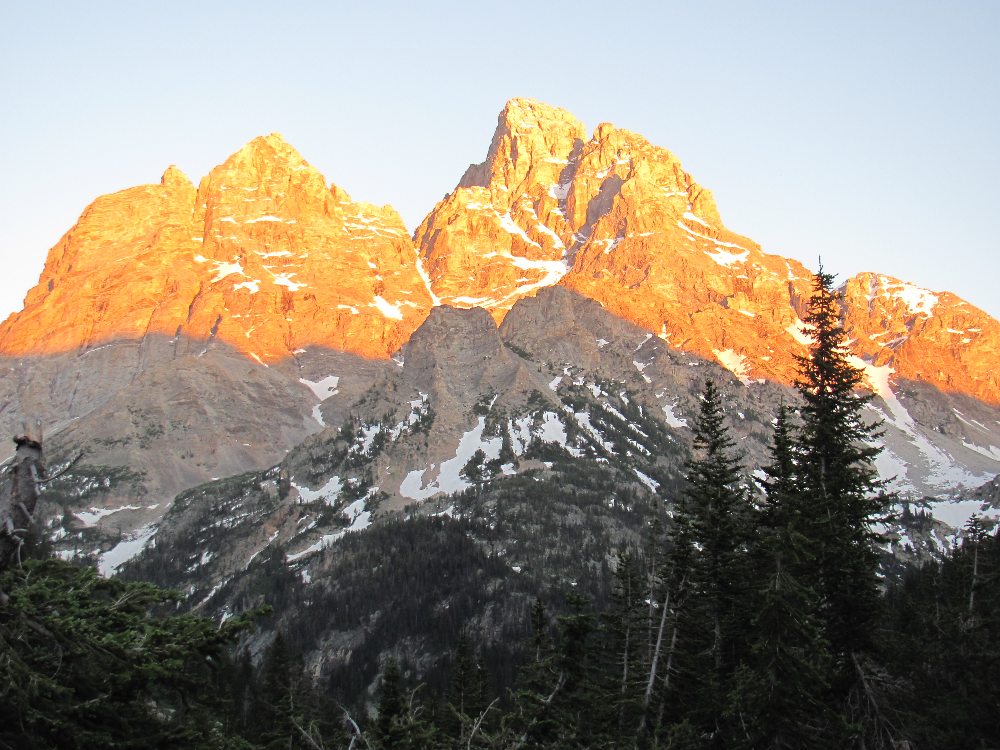

  

## Hiking the [Rockies](https://www.nps.gov/romo/index.htm)

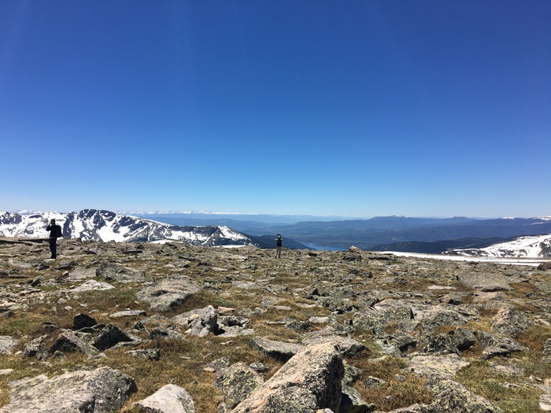

  

## Kayaking the [Wacissa River](http://wwgw.dep.state.fl.us/gwt/guide/designated_paddle/Wacissa_guide.pdf) 

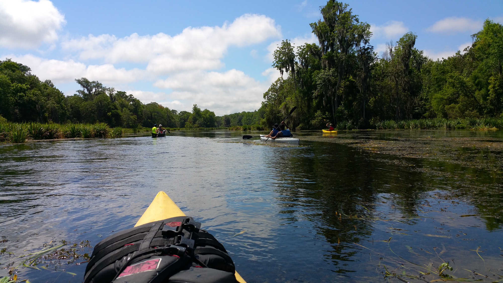

  

## Camping on [Port St Joe](https://www.floridastateparks.org/park/St-Joseph) 

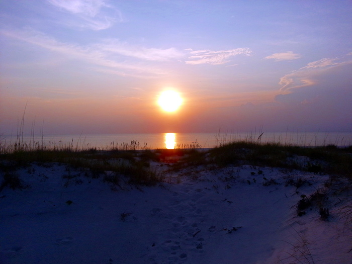

  

## Hiking the [Florida National Scenic Trail](http://floridahikes.com/floridatrail/suwannee/) 

  

## Kayaking the [Suwannee River](https://www.floridastateparks.org/park/Suwannee-River) 

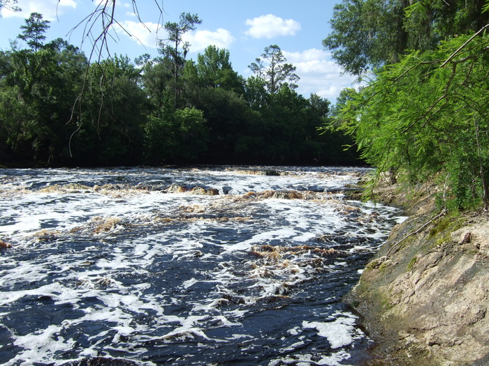

  

## Hiking in [Providence Canyon](http://gastateparks.org/ProvidenceCanyon/) 

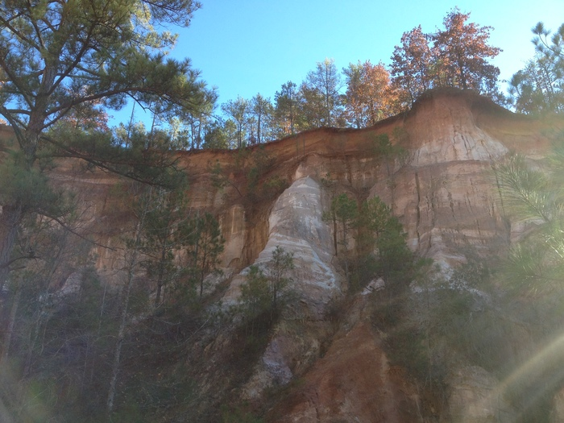

  

## Hiking in [Nantahala National Park](http://www.stateparks.com/nantahala.html) 

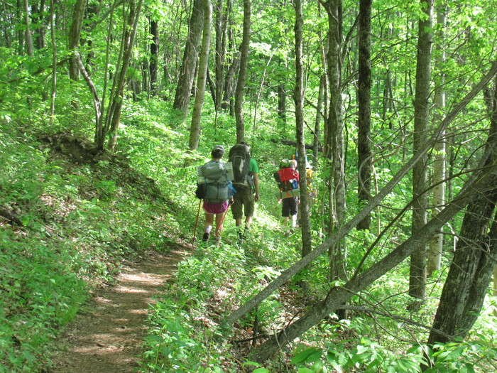

  

## Biking at [Rattlesnake River](https://www.singletracks.com/bike-trails/rattlesnake-ridge.html) 

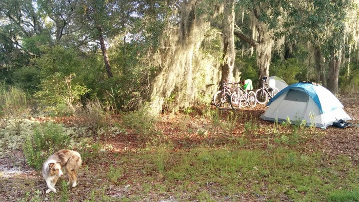

  

## Canoeing the [Blackwater River](https://www.floridastateparks.org/park/Blackwater-River) 

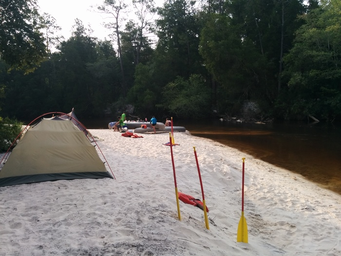

  

## Hiking the [Great Smoky Mountains](https://www.nps.gov/grsm/index.htm) 

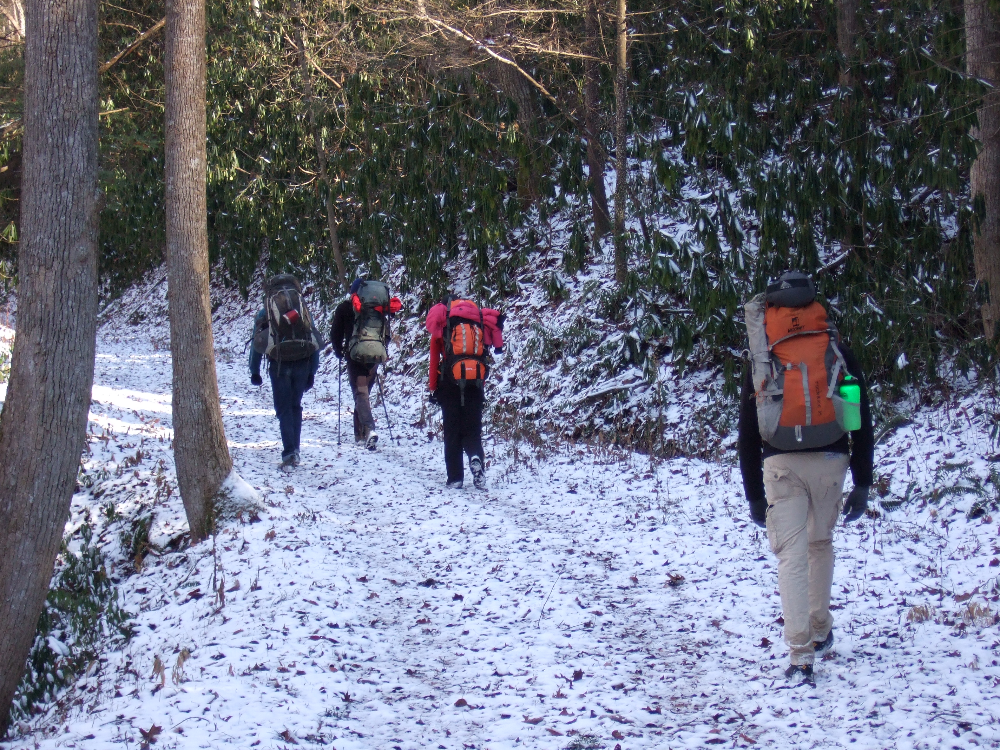

  

## Kayaking the [Sopchoppy River](http://www.visitwakulla.com/Things-to-Do/Sopchoppy-River-Paddling-Trail) 

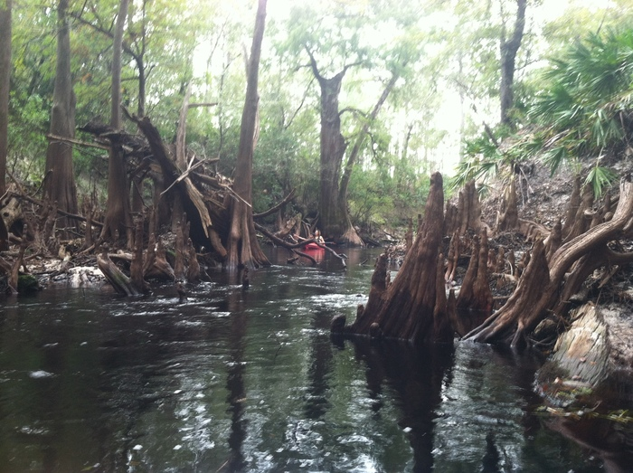

